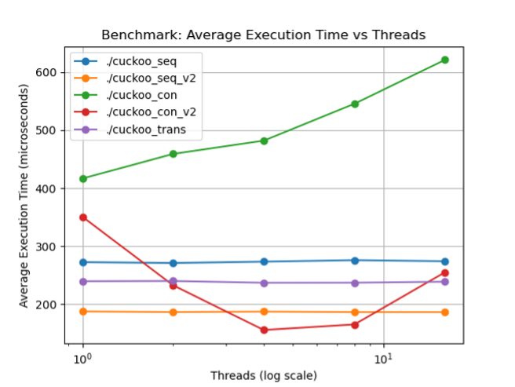
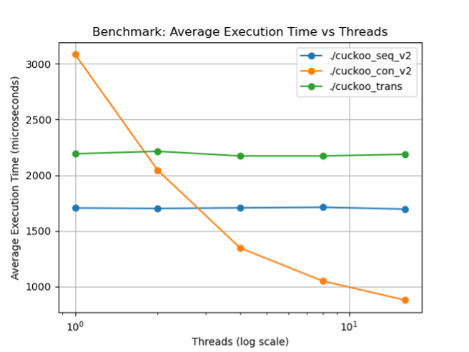

# Transactional & Concurrent Cuckoo Hash Set

This repository implements and benchmarks multiple variants of a cuckoo hash **set** with different concurrency strategies. It compares **sequential** baselines, **striped-lock** concurrent versions, and a **transactional (STM)** approach, and includes a reproducible benchmarking + plotting pipeline.

## Results at a glance

<p align="center">
  
</p>
<p align="center"><sub><em>10,000 operations · 1,000 buckets · average execution time vs. threads (log scale)</em></sub></p>

<p align="center">
  
</p>
<p align="center"><sub><em>100,000 operations · 10,000 buckets · average execution time vs. threads (log scale)</em></sub></p>

*Reproduce:* see **Reproduce in 60s** below.

---

## Implementations

- **Sequential v1/v2** — Baseline single-threaded variants (micro-optimizations differ).  
- **Concurrent v1** — Coarse/striped locking; simple correctness, moderate contention.  
- **Concurrent v2** — Optimized striped locking; better cache behavior and early-exit on misses.  
- **Transactional (STM)** — Lock-free from the user’s point of view; retries on conflicts.

Each variant exposes set-style operations (e.g., `insert`, `contains`, `erase`) and is compiled into a separate executable.

## Reproduce in 60s

## Reproduce in 60s

```bash
# 1) Build all variants (root-level binaries: cuckoo_seq, cuckoo_seq_v2, cuckoo_con, cuckoo_con_v2, cuckoo_trans)
make

# 2) Run the benchmark suite (writes CSVs to ./results/ if your script does so)
python3 benchmark.py

# 3) Generate the two figures used above
python3 plot.py  # produces the PNGs; 
```

> **Notes**
> - Ensure your toolchain supports threads: compile flags typically include `-pthread` (already set in the Makefile).  
> - If your transactional build requires a specific STM library or flag, install it first or adjust the Makefile accordingly.


## Benchmarking

The benchmark sweeps across **operation counts**, **bucket counts / table sizes**, and **thread counts**, measuring **throughput (ops/sec)**. CSVs are written to `./results/` and consumed by `plot.py` to generate the two figures above.

Typical command-line options (check `benchmark.py -h` in your repo for the exact set):

```
--ops 100000      # operations per trial
--threads 1..16   # number of worker threads
--buckets 1000    # bucket count / initial capacity
--trials 5        # repeat & average
```

## Highlights

- **Low thread counts:** the **optimized sequential** version is often fastest (no sync overhead).  
- **High thread counts:** **concurrent v2 (striped locks + atomics/early-exit)** scales best as contention rises.  
- **Transactional (STM):** correctness-friendly, but retries under contention reduce throughput (expect slower curves at higher threads).  
- **Unoptimized concurrent:** generally slowest due to coarse locking and cache contention.
